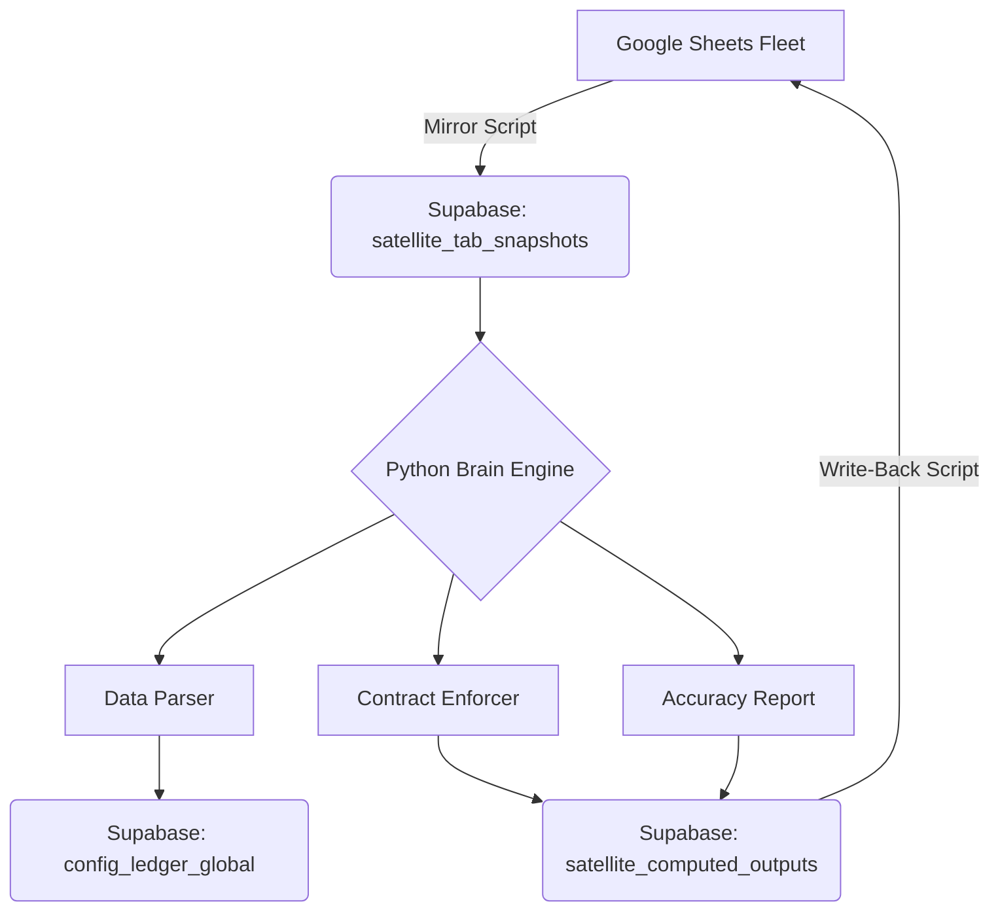

# 🧠 Architecture: Supabase Brain

The "Brain" architecture shifts the "Source of Truth" and "Computational Authority" from individual Google Sheets to a centralized Python engine and Supabase database.

## 🔄 The New Pipeline

## 🏗️ Core Modules

1.  **Data Parser (`brain/data_parser.py`)**: 
    Handles the "sloppy" nature of 500 different satellites. It uses alias mapping to find columns even if headers vary slightly (e.g., "Home Team" vs "Home").
2.  **Contract Enforcer (`brain/contract_enforcer.py`)**: 
    The "Law" of the universe. It ensures every prediction is formatted into exactly 25 columns, with consistent data types and deterministic `Config_Stamp_IDs`.
3.  **Accuracy Report (`brain/accuracy_report.py`)**: 
    Automates the grading that used to happen in Apps Script. It compares predictions against the `Results_Clean` snapshots to determine WIN/LOSS/PUSH.
4.  **Sheet Writer (`brain/sheet_writer.py`)**: 
    Bypasses the 6-minute Apps Script execution limit and Google API quotas by rotating through 15 service accounts.

## 🛡️ Safety Philosophy

The system is designed with **"Inertia by Default"**. 
*   The Python engine *reads* snapshots, but it never modifies the original snapshots.
*   The `satellite_computed_outputs` table acts as a buffer.
*   Write-backs to live Sheets require an explicit `--write-back` flag and should only be enabled after Layer 1-3 audits pass.

## 📈 Scale Performance

*   **Legacy (.gs)**: ~30 seconds per satellite. Total fleet (500) = 4.1 hours. Limited by Apps Script serial execution.
*   **New (Python)**: ~1.5 seconds per satellite. Total fleet (500) = ~12 minutes. Can be parallelized further if needed.
